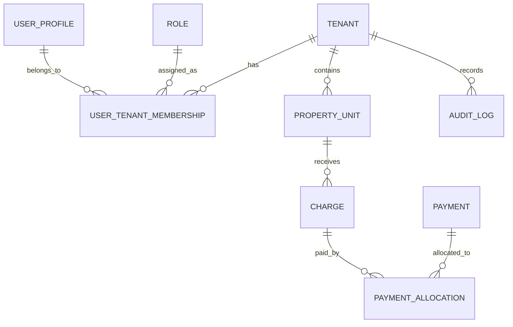

# RESIDENT Core — Constitución SDD v0.2

## 1. Información
Ruta: `docs/sdd/constitution.md`  
Versión: 0.2  
Estado: Borrador rector actualizado.  
Cambio: incorpora Keycloak como proveedor objetivo de identidad antes de microservicios físicos.

## 2. Propósito
RESIDENT Core es el sistema transaccional central del ecosistema RESIDENT. Automatiza procesos administrativos, financieros, operativos y comunitarios de conjuntos residenciales bajo un modelo multitenant. WordPress será portal informativo y punto de entrada; Core será fuente de verdad transaccional.

## 3. Alcance inicial
Tenants, usuarios/perfiles/membresías/roles/permisos, residentes, propietarios, unidades, alícuotas, estados de cuenta, pagos, comprobantes, movimientos bancarios, conciliación, reservas, multas, reuniones, notificaciones, reportes, auditoría, WordPress, n8n y preparación para microservicios.

## 4. Principios rectores
### 4.1. La especificación manda sobre el código
Ningún módulo crítico se implementa sin spec SDD. Cada spec incluye reglas, criterios de aceptación, modelo de datos, contratos API, pruebas, seguridad, auditoría, datos personales y relación con tenants.

### 4.2. Multitenancy desde el diseño
Cada registro operativo pertenece a un tenant. Todo endpoint sensible valida tenant, membership, permiso y recurso.

### 4.3. Modularidad antes que microservicios
La primera versión será monolito modular contenerizado. La extracción a microservicios requiere evidencia técnica y ADR.

### 4.4. Autenticación externalizable
Durante el MVP se permite autenticación propia temporal si acelera el desarrollo, pero la arquitectura objetivo debe adoptar un proveedor compatible con OpenID Connect/OAuth2.

```text
Keycloak será el Identity Provider objetivo de RESIDENT Core antes de migrar a microservicios físicos.
```

Keycloak gestionará login, credenciales, sesiones, refresh tokens, password reset, MFA, SSO, identity brokering y tokens OIDC/OAuth2. Core seguirá gestionando tenants, memberships, roles funcionales, permisos de negocio, autorización por recurso, reglas financieras, auditoría y trazabilidad.

### 4.5. Finanzas auditables
Pagos, cargos, multas, conciliaciones y movimientos financieros no se eliminan físicamente. Correcciones mediante reversos, anulaciones o ajustes auditables.

### 4.6. Seguridad desde la especificación
Cada módulo define roles, permisos, datos sensibles, validaciones, riesgos, auditoría, pruebas de acceso no autorizado, controles multitenant e impacto de identidad.

### 4.7. Protección de datos personales
Aplicar minimización, finalidad, acceso por rol/tenant, registro de cambios, protección en APIs y derechos de titulares cuando proceda.

### 4.8. API-first
Core expondrá APIs versionadas y documentadas mediante OpenAPI. WordPress puede pasar pista de tenant, pero no autorizar.

### 4.9. Pruebas obligatorias
Unitarias, integración, autorización, aislamiento multitenant, reglas de negocio, contratos API, regresión financiera y validación de tokens cuando aplique Keycloak.

### 4.10. Uso responsable de IA
La IA no aprueba código crítico, no inventa reglas, no elimina históricos, no crea bypasses de autenticación ni trata Keycloak como autorización de negocio.

## 5. Estructura SDD
```text
resident-core/
├── docs/
│   ├── sdd/
│   ├── specs/
│   ├── decisions/
│   └── changes/
├── apps/
├── packages/
├── prisma/
├── docker/
├── keycloak/
├── scripts/
├── tests/
└── docker-compose.yml
```

## 6. Estructura por spec
Cada módulo contiene `spec.md`, `plan.md`, `tasks.md`, `data-model.md`, `api-contract.md`, `test-plan.md` y `security-notes.md`.

## 7. Criterios generales de aceptación
Funcionalidad aceptada si tiene spec, pruebas, tenant validation, permisos, auditoría, documentación, ejecución local y compatibilidad con Keycloak.

## 8. MVP prioritario
Tenants, usuarios/perfiles/memberships/roles/permisos, residentes-propiedades, alícuotas, estados de cuenta, pagos, comprobantes, auditoría, reportes básicos e integración WordPress.

## 9. Decisiones pendientes
Momento exacto de Keycloak, despliegue, realm `resident`, clients OIDC, MFA por rol, frontend, cloud y alcance final MVP.

## 10. Definición de terminado
Compila, prueba, cumple criterios, respeta multitenancy, permisos, auditoría, documentación y ADR-006.

## 11. Regla final
La velocidad no puede estar por encima de consistencia, seguridad, trazabilidad, protección de datos y confiabilidad.


---

# RESIDENT Core — Domain Map v0.2

## 1. Información
Ruta: `docs/sdd/domain-map.md`  
Versión: 0.2  
Cambio: separación de identidad técnica y autorización de negocio.

## 2. Dominio principal
Gestión transaccional, financiera, operativa y comunitaria de conjuntos residenciales bajo un modelo multitenant.

## 3. Lenguaje ubicuo
| Término | Definición |
|---|---|
| RESIDENT Portal | Portal WordPress de FASE 1. |
| RESIDENT Core | Sistema transaccional central. |
| Identity Provider | Servicio externo para identidad técnica. |
| Keycloak | Identity Provider objetivo antes de microservicios. |
| Tenant | Conjunto residencial dentro de la plataforma. |
| UserProfile | Perfil local mínimo de usuario en Core. |
| keycloakSubjectId | Identificador `sub` emitido por Keycloak. |
| Membership | Relación usuario-tenant. |
| Rol funcional | Perfil de negocio dentro de tenant. |
| Permiso de negocio | Acción autorizada, por ejemplo `payments.confirm`. |
| Unidad habitacional | Casa, departamento, lote, bodega o parqueadero. |
| Cargo | Valor financiero contra una unidad. |
| Pago | Registro de dinero recibido. |

## 4. Subdominios
Core Domain: finanzas residenciales, alícuotas, pagos, conciliación, multas, reportes y autorización por recurso.  
Supporting Domains: residentes, propiedades, reservas, reuniones, comunicaciones, documentos, WordPress, n8n, Keycloak.  
Generic Domains: identidad técnica, sesiones, MFA, correo, storage, logs y configuración.

## 5. Bounded contexts
```text
Platform Management
Tenant Management
Identity Integration
Access and Authorization
Residents and Properties
Financial Management
Payments and Reconciliation
Reservations and Rentals
Fines and Sanctions
Meetings and Attendance
Communications and Notifications
Reporting and Analytics
Audit and Compliance
External Integrations
```

## 6. Identity Integration
Integra identidad técnica. MVP puede usar auth propia temporal; objetivo: Keycloak. Keycloak gestiona login, credenciales, sesiones, refresh tokens, MFA, password reset, tokens, federación y SSO.

## 7. Access and Authorization
Gestiona membership usuario-tenant, roles funcionales, permisos, acceso por recurso y auditoría.

```text
Keycloak autentica; RESIDENT Core autoriza.
```

## 8. Contextos de negocio
Tenant Management: Tenant, TenantProfile, TenantConfiguration, TenantBranding, TenantContactInfo, WordPressMapping.  
Residents and Properties: Person, LegalEntity, PropertyUnit, PropertyOwnership, Residency, Lease, Vehicle, Pet.  
Financial: ChargeConcept, FeeSchedule, Fee, ExtraordinaryFee, Charge, AccountStatement, Balance, LateFeeRule, Adjustment, Reversal.  
Payments: Payment, PaymentAllocation, PaymentReceipt, BankAccount, BankMovement, Reconciliation.

## 9. Integraciones
WordPress es portal. Keycloak es IdP objetivo. n8n automatiza procesos auxiliares. Correo/WhatsApp notifican. Banco/CSV importa movimientos. Storage guarda documentos.

## 10. Modelo conceptual


## 11. Invariantes
Todo registro operativo pertenece a tenant. Ningún usuario accede a otro tenant sin autorización. Movimientos financieros no se eliminan físicamente. WordPress y n8n no son fuente transaccional. Keycloak no sustituye autorización de negocio.

## 12. Eventos
TenantCreated, UserProfileLinkedToIdentityProvider, UserJoinedTenant, UserRoleChanged, MonthlyFeesGenerated, ChargeCreated, PaymentRegistered, PaymentConfirmed, PaymentReversed, ReconciliationMatchConfirmed, ReservationApproved, FineIssued, NotificationSent, AuditLogCreated.

## 13. MVPs
MVP 1: tenants, users-roles-access, residents-properties, dues-fees, payments, account-statements, audit, reports, WordPress integration.  
MVP 2: reservations, fines, notifications, bank-reconciliation, documents.  
MVP 3: meetings, attendance, voting, resolutions.  
MVP 4: n8n automations, AI-assisted reports, resident self-service.

## 14. Conclusión
El dominio separa identidad técnica de autorización de negocio. Keycloak autentica; Core decide qué puede hacer cada usuario dentro de cada tenant y recurso.


---

# RESIDENT Core — Architecture v0.2

## 1. Información
Ruta: `docs/sdd/architecture.md`  
Versión: 0.2  
Cambio: Keycloak como componente objetivo de identidad antes de microservicios.

## 2. Decisión arquitectónica inicial
```text
Backend modular monolith + API-first + PostgreSQL + Redis + Docker + Keycloak objetivo
```

## 3. Stack tecnológico
| Capa | Tecnología |
|---|---|
| Backend | NestJS + TypeScript |
| Runtime | Node.js 24.18.0 LTS |
| Package manager | pnpm 11.21.0 |
| DB | PostgreSQL |
| ORM | Prisma |
| Cache/colas | Redis |
| Jobs | BullMQ o equivalente |
| Identidad objetivo | Keycloak |
| API docs | OpenAPI / Swagger |
| Autorización | RBAC/permissions por tenant en Core |
| Testing | Jest + integración |
| Automatización | n8n |
| Storage | S3-compatible |
| Contenedores | Docker / Docker Compose |

## 4. Arquitectura lógica
```text
WordPress Portal
      │
      │ link / tenant hint / public API
      ▼
Keycloak Identity Provider objetivo
      │
      │ OIDC/OAuth2 access token
      ▼
RESIDENT Core API
      ├── Platform
      ├── Tenants
      ├── Identity Integration
      ├── Access Control
      ├── Residents & Properties
      ├── Financial
      ├── Payments
      ├── Reports
      └── Audit
      ├── PostgreSQL
      ├── Redis
      └── File Storage
```

## 5. Capas
Interface, Application, Domain e Infrastructure. Controladores no contienen reglas de negocio.

## 6. Módulos
platform, tenants, identity-integration, access-control, residents-properties, financial, payments, reconciliation, reservations, fines, meetings, communications, reports, audit, integrations.

## 7. Identity Integration
Valida tokens, mapea `sub` de Keycloak a UserProfile, soporta auth temporal propia, transición a Keycloak y configuración OIDC.

## 8. Access Control
Gestiona memberships, roles por tenant, permisos funcionales, validaciones por recurso, políticas financieras y pruebas cross-tenant.

## 9. Multitenancy
Single database + shared schema + tenant_id obligatorio. Keycloak no tendrá realm por tenant en MVP; los tenants de negocio viven en Core.

## 10. Identidad
Keycloak objetivo para login, password reset, MFA, refresh tokens y SSO. Core para membership, roles funcionales, permisos, autorización y auditoría.

## 11. Base de datos
PostgreSQL con Prisma, tenant_id, Decimal, transacciones ACID, migraciones versionadas, auditoría y preparación para `keycloakSubjectId`.

## 12. API
REST v1. Durante MVP `/auth/*` puede ser propio; con Keycloak se externaliza login y Core valida Bearer tokens OIDC.

## 13. WordPress
WordPress tenant page → `/login?tenant=villa-club` → Keycloak Login → Core Dashboard. WordPress pasa pista de tenant, no autoriza.

## 14. n8n
n8n consume APIs Core. Con Keycloak usa service account/client credentials. No accede a PostgreSQL ni modifica saldos.

## 15. Infraestructura local
resident-api, resident-worker, postgres, redis, minio, mailhog. En modo Keycloak: keycloak, keycloak-postgres.

## 16. CI/CD y pruebas
Pipeline con install, lint, typecheck, tests, multitenant tests, build, docker build y security checks. Pruebas de tokens Keycloak, audience, issuer, expiración y autorización posterior.

## 17. Observabilidad
Logs con timestamp, traceId, tenantId, userProfileId o keycloakSubjectId, acción y resultado. No tokens ni secretos.

## 18. Microservicios futuros
Antes de extraer servicios: Keycloak implementado, validación OIDC, tenant y permisos de negocio, contratos, gateway y observabilidad distribuida.

## 19. Conclusión
Core inicia modular y monolítico. Keycloak será IdP objetivo antes de microservicios; autorización de negocio permanece en Core.


---

# RESIDENT Core — Security Architecture v0.2

## 1. Información
Ruta: `docs/sdd/security.md`  
Versión: 0.2  
Cambio: Keycloak como IdP objetivo y separación auth/autorización.

## 2. Propósito
Proteger datos personales, aislar tenants, proteger finanzas, prevenir accesos indebidos, mantener trazabilidad y preparar Keycloak.

## 3. Baseline
OWASP ASVS nivel objetivo 2, OWASP API Security Top 10, OWASP Top 10, buenas prácticas OAuth2/OIDC, privacidad desde el diseño y normativa ecuatoriana aplicable.

## 4. Amenazas
Acceso cross-tenant, escalamiento, robo de token, token mal validado, Keycloak mal configurado, manipulación de pagos, archivos maliciosos, secretos en Git, logs con datos personales, n8n con permisos excesivos y código IA inseguro.

## 5. Autenticación
MVP: auth propia temporal permitida. Objetivo: Keycloak como IdP central.

Si auth propia: email/password, hash fuerte, access corto, refresh revocable, sesiones, rate limiting, recuperación segura, auditoría.

Con Keycloak: validar firma, issuer, audience, expiración, subject, estado local, membership, permisos y recurso.

## 6. Autorización
Keycloak autentica. Core autoriza tenant, membership, rol, permiso, recurso, estado y reglas financieras.

## 7. Aislamiento multitenant
tenant_id, membership, repositorios tenant-aware, filtros, pruebas cross-tenant, cache/storage/jobs/eventos/auditoría por tenant.

## 8. Finanzas
Movimientos financieros inmutables históricamente. Correcciones con reversos o ajustes. Usar transacciones, idempotencia, auditoría y Decimal.

## 9. APIs y archivos
HTTPS, Bearer token, validación token propio/Keycloak, autorización por recurso, validación estricta, rate limiting, errores seguros, idempotencia y OpenAPI. Archivos en storage privado, separados por tenant.

## 10. Keycloak
Realm `resident`, no realm por tenant en MVP, redirect URIs exactas, web origins restringidos, HTTPS, MFA para admins, backup DB, no claims sensibles, mappers revisados, rotación de secretos, service accounts limitadas.

## 11. DB y logs
DB con mínimos privilegios, no pública, migraciones revisadas y backups. Logs con tenantId, userProfileId, keycloakSubjectId, acción, recurso, resultado y traceId; nunca contraseñas, tokens o secretos.

## 12. WordPress/n8n
WordPress no autentica ni maneja pagos. n8n usa APIs Core, credenciales mínimas y service account limitada si Keycloak.

## 13. IA
No usar datos reales, no crear bypass auth, no desactivar tenant validation, no proponer auth propia permanente, no tratar Keycloak como autorización financiera.

## 14. Pruebas
Token inválido/expirado, issuer/audience incorrectos, acceso sin permiso, otro tenant, mass assignment, rate limit, archivos, reversos y permisos por recurso.

## 15. Criterios
No aceptar funcionalidad sin tenant, permisos, pruebas, auditoría crítica o que contradiga ADR-006.

## 16. Conclusión
Keycloak será IdP objetivo; Core conserva autorización de negocio, multitenancy, auditoría financiera y reglas por recurso.


---

# RESIDENT Core — API Guidelines v0.2

## 1. Información
Ruta: `docs/sdd/api-guidelines.md`  
Versión: 0.2  
Cambio: Bearer token temporal propio o emitido por Keycloak en objetivo.

## 2. Principios
API-first, privada por defecto, multitenancy obligatorio, contratos estables, trazabilidad e identidad desacoplada.

## 3. Estilo
REST API versionada en `/api/v1`.

## 4. Auth temporal
Si se usa auth propia: `/auth/login`, `/auth/refresh`, `/auth/logout`, `/auth/forgot-password`, `/auth/reset-password`, `/auth/switch-tenant`, `/auth/me`.

Con Keycloak, login/refresh/password reset se trasladan al IdP y Core valida tokens.

## 5. Autenticación API
```text
Authorization: Bearer <access_token>
```
MVP: token del Core. Objetivo: token Keycloak. Validar firma, expiración, issuer, audience, subject, estado local, membership y permisos.

## 6. Tenant resolution
Tenant activo se resuelve desde token, UserProfile, tenant seleccionado, membership, rol y permisos. El body no acepta tenantId libremente.

## 7. Autorización
Cada endpoint declara permiso. Ejemplos: `payments.read`, `payments.confirm`, `reports.financial.read`.

## 8. Endpoints principales
Tenants: `GET/POST /tenants`, `GET /public/tenants/{slug}`.  
Access: `GET /user-profiles`, `POST /users/invite`, `GET /roles`, `GET /permissions`.  
Financial: `GET /charges`, `POST /fees/generate-monthly`, `GET /payments`, `POST /payments/{id}/confirm`.

## 9. Request/response
Fechas ISO 8601, dinero decimal string, IDs UUID/no predecibles.

## 10. Error format
```json
{"error":{"code":"ACCESS_DENIED","message":"You are not authorized.","details":{},"traceId":"req_123456"}}
```

## 11. Paginación e idempotencia
`?page=1&pageSize=20`, máximo 100. Idempotencia para pagos, alícuotas, importaciones, webhooks, n8n y cargos masivos.

## 12. Auditoría
Auditar login, cambio de tenant, roles, alícuotas, pagos, reversos, conciliaciones, multas, reservas, exportaciones y documentos sensibles.

## 13. WordPress/n8n
WordPress consume públicos y redirige a Core/Keycloak. n8n usa APIs Core y service account con Keycloak.

## 14. OpenAPI y pruebas
Cada endpoint documenta auth, permiso, tenant, request, response, errores, auditoría e idempotencia. Pruebas: token inválido, issuer/audience, permisos, otro tenant, estado e idempotencia.

## 15. Conclusión
La API valida tokens temporales del Core o tokens Keycloak objetivo; autorización de negocio sigue en Core.


---

# RESIDENT Core — Data Governance v0.2

## 1. Información
Ruta: `docs/sdd/data-governance.md`  
Versión: 0.2  
Cambio: identidad técnica en Keycloak y datos de negocio en Core.

## 2. Propósito
Garantizar datos correctos, seguros, trazables, auditables, separados por tenant y aptos para reportes, automatizaciones e IA controlada.

## 3. Principios
Datos como activos críticos, tenant como frontera primaria, trazabilidad antes que eliminación, minimización, privacidad por diseño y separación identidad/negocio.

## 4. Clasificación
Públicos, internos, confidenciales y restringidos. Restringidos: cédulas, pagos, deudas, comprobantes, banco, tokens, secretos y backups.

## 5. Identidad técnica
Keycloak será fuente objetivo para credenciales, contraseñas, sesiones, refresh tokens, MFA, recuperación, federación y eventos técnicos de login.

## 6. UserProfile local
```text
UserProfile
├── id
├── keycloakSubjectId
├── externalSubjectId
├── authProvider
├── email
├── displayName
├── status
└── timestamps
```

## 7. Datos de negocio en Core
Tenants, configuración, memberships, roles funcionales, permisos, residentes, propietarios, unidades, cargos, pagos, comprobantes, conciliación, multas, reservas, reuniones, auditoría y reportes.

## 8. Datos financieros
Cargos, pagos, saldos, comprobantes, movimientos, conciliaciones, ajustes y reportes. No sobrescribir historia; usar eventos, ajustes o reversos.

## 9. Responsabilidades
Plataforma define políticas. Tenant asegura uso legítimo. Equipo técnico implementa controles. Admins Keycloak gestionan realm, clients, MFA, backups y actualizaciones.

## 10. Ciclo de vida
Recolección, validación, almacenamiento, uso, actualización, consulta, exportación, archivo, retención, eliminación lógica/anonimización/conservación.

## 11. Multitenancy
Single DB + shared schema + tenant_id. Índices, constraints, jobs, eventos, logs y storage consideran tenant.

## 12. Finanzas y auditoría
Saldos se reconstruyen desde cargos, pagos, aplicaciones, ajustes, reversos y moras. Auditar roles, permisos, perfiles, memberships, configuración financiera, tenants, unidades, pagos, reversos, conciliaciones, exportaciones y accesos sensibles.

## 13. Retención y backups
Finanzas y auditoría: conservación prolongada. Logs: 90-180 días. Exportaciones temporales: 7-30 días. Respaldar Core DB, archivos, configuración, auditoría, Keycloak DB y realm export cuando sea viable.

## 14. Ambientes, migraciones e IA
No datos reales en no productivo sin anonimización. Migraciones preservan UserProfile, keycloakSubjectId y memberships. IA solo con datos ficticios/anonimizados salvo evaluación formal.

## 15. Integraciones
WordPress solo datos públicos. n8n datos mínimos por API. Keycloak gestiona identidad; Core conserva keycloakSubjectId, perfil local, membership, roles, permisos y auditoría.

## 16. Derechos e incidentes
Preparar acceso, rectificación, actualización, eliminación cuando proceda, oposición, suspensión y portabilidad. Exposición entre tenants es incidente crítico.

## 17. Conclusión
Keycloak será fuente objetivo de identidad; Core conserva datos de negocio, tenants, memberships, permisos funcionales, auditoría y reglas financieras.


---

# ADR-003 — Database Strategy: PostgreSQL as Primary Transactional Database v0.2

## 1. Decisión
PostgreSQL como base relacional transaccional principal, Prisma ORM, migraciones versionadas, shared schema con tenant_id y UserProfile con externalSubjectId/keycloakSubjectId.

## 2. Justificación
PostgreSQL es relacional, ACID, maduro, soporta integridad, constraints, índices, transacciones, Decimal, JSONB controlado, Docker, cloud y NestJS/Prisma.

## 3. Multitenancy
Toda tabla operativa incluye tenant_id. Constraints e índices consideran tenant. Repositorios exigen tenant.

## 4. Identidad en DB
Auth propia temporal puede tener auth_sessions, refresh_tokens y password_reset_tokens. No son dependencia permanente.

Objetivo Keycloak:
```text
user_profiles(id,email,display_name,auth_provider,external_subject_id,keycloak_subject_id,status,timestamps)
```

## 5. Membership
```text
user_tenant_memberships(id,user_profile_id,tenant_id,role_id,status,invited_by,joined_at,timestamps)
```

## 6. Tablas iniciales
tenants, user_profiles, roles, permissions, role_permissions, user_tenant_memberships, persons, property_units, charges, payments, payment_allocations, receipts, account_statements, bank_accounts, bank_movements, reconciliations, reservations, fines, meetings, notifications, audit_logs.

## 7. Finanzas
Nunca float/double. Usar Decimal. Transacciones para alícuotas, pagos, reversos, multas con cargo, reservas con cargo, conciliación, ajustes y recálculo.

## 8. Auditoría
audit_logs registra tenant, userProfileId, keycloakSubjectId si aplica, acción, recurso, estado anterior/posterior, motivo, traceId y resultado.

## 9. Eliminación y migraciones
No eliminar físicamente datos financieros ni auditoría. Migraciones con revisión, pruebas, backup y preservación de UserProfile/keycloakSubjectId/memberships.

## 10. Backups e índices
Backup diario DB, documentos y Keycloak DB cuando exista. Índices: tenants(slug), user_profiles(email), user_profiles(keycloak_subject_id), memberships(tenant_id,user_profile_id), charges/payments/audit por tenant.

## 11. Idempotencia
idempotency_keys, external_event_id y constraints por tenant para pagos, webhooks, alícuotas, importaciones y jobs.

## 12. Decisión final
PostgreSQL + Prisma soportan multitenancy, finanzas auditables y transición limpia a Keycloak, manteniendo autorización en Core.


---

# ADR-004 — Multitenancy Strategy: Shared Schema with Tenant Isolation v0.2

## 1. Decisión
```text
Single database + shared schema + tenant_id obligatorio + RBAC por tenant + validación backend.
```

Keycloak:
```text
Realm principal: resident.
No crear realm por conjunto en MVP.
Tenants de negocio se gestionan en Core.
```

## 2. Justificación
Shared schema reduce costo y complejidad. Realm único permite usuarios multi-tenant y evita duplicar configuración. La autorización financiera depende del dominio y queda en Core.

## 3. Resolución tenant activo
Validar token propio/Keycloak, identificar subject, mapear UserProfile, identificar tenant, validar membership, validar estado, cargar rol/permisos y ejecutar con tenant_id.

## 4. Membership y roles
UserTenantMembership contiene userProfileId, tenantId, roleId, status, invitedBy, joinedAt y timestamps. Globales: SuperAdmin, PlatformOperator, PlatformSupport. Tenant: TenantAdmin, Treasurer, BoardMember, Resident, PropertyOwner, Guard, TenantAuditor.

## 5. DB/API/cache/jobs/eventos/archivos
Toda tabla operativa tiene tenant_id. Endpoints privados no aceptan tenantId libre en body. Cache usa `tenant:{tenantId}:...`. Jobs/eventos incluyen tenantId. Archivos se separan por tenant.

## 6. Auditoría
Incluye tenantId, userProfileId, keycloakSubjectId, action, resourceType, resourceId, occurredAt, traceId y result.

## 7. WordPress
WordPress identifica tenant por slug/URL y pasa pista, pero no autoriza:
```text
WordPress tenant page → /login?tenant=villa-club → Keycloak/Core Login → Core valida membership → Dashboard
```

## 8. Testing
Usuario Tenant A intentando acceder a recurso Tenant B debe recibir denegación sin fuga de información.

## 9. Repositorios
Correcto: `findPaymentById(tenantId, paymentId)`. Evitar búsqueda solo por id salvo contexto global auditado.

## 10. Migración futura
Ruta posible: shared schema → dedicated schema → dedicated database. Requiere ADR.

## 11. Decisión final
Core adopta aislamiento lógico con tenant_id. Keycloak usará realm `resident`. La autorización por tenant sigue en Core.


---

# ADR-005 — Authentication Strategy: Evolutionary Authentication with Keycloak Target v0.2

## 1. Decisión
```text
MVP: autenticación propia temporal permitida.
Arquitectura objetivo: Keycloak como Identity Provider central.
```

Auth propia en NestJS no será permanente. Antes de microservicios físicos, Keycloak deberá estar implementado.

## 2. Responsabilidades
| Responsabilidad | MVP | Objetivo |
|---|---|---|
| Login, password, reset, access/refresh token | Core | Keycloak |
| MFA/SSO | Diferido | Keycloak |
| Tenant membership, roles funcionales, permisos, autorización, auditoría financiera | Core | Core |

## 3. Principios
Autenticación no es autorización. Usuario autenticado no accede a todos los tenants. Keycloak no sustituye reglas de negocio. WordPress no autentica Core.

## 4. Flujo MVP
Email/password, validación Core, tenants disponibles, sesión, tokens, selección de tenant y carga de permisos.

## 5. Flujo objetivo
Redirección a Keycloak, token OIDC, Core valida issuer/audience/firma/expiración, mapea sub a UserProfile, valida membership y autoriza negocio.

## 6. Tokens
MVP: JWT corto, refresh revocable, hash en DB, payload mínimo. Objetivo: token Keycloak con claims mínimos. No incluir saldos, deudas, comprobantes o permisos financieros extensos.

## 7. Tenant activo
Si usuario tiene varios tenants, selecciona tenant activo. Core valida membership aunque token sea Keycloak.

## 8. Invitaciones y WordPress
Invitaciones de negocio siguen en Core. WordPress no autentica Core:
```text
WordPress tenant page → /login?tenant=villa-club → Keycloak Login → Core Dashboard
```

## 9. Base de datos
MVP temporal: user_profiles, auth_sessions, refresh_tokens, password_reset_tokens, invitations. Objetivo: user_profiles(keycloak_subject_id), memberships, roles, permissions, role_permissions, audit_logs.

## 10. Pruebas
MVP: login, rate limit, refresh, logout, password reset, tenant selection. Keycloak: token válido, expirado, issuer/audience incorrectos, firma inválida, subject sin perfil, usuario deshabilitado, membership inexistente y permisos insuficientes.

## 11. Riesgos
Auth propia permanente, token mal validado, Keycloak mal configurado, confundir auth con autorización, tenant selection insegura y WordPress como auth.

## 12. Decisión final
Auth propia en NestJS solo como transición. Keycloak será proveedor central antes de microservicios. Core conserva membership, roles funcionales, permisos, autorización por recurso, auditoría y reglas financieras.


---

# ADR-006 — Identity Provider Strategy: Keycloak as Target Identity Provider v0.1

## 1. Decisión
```text
Keycloak será el Identity Provider objetivo de RESIDENT Core antes de migrar a microservicios físicos.
```

Durante MVP se permite auth propia temporal si acelera el desarrollo y permite migración limpia.

## 2. Separación
Keycloak: autenticación, login, credenciales, sesiones, refresh tokens, password reset, MFA, SSO, identity brokering, tokens OIDC/OAuth2.

Core: tenants, memberships, roles de negocio, permisos funcionales, autorización por recurso, auditoría funcional, reglas financieras y trazabilidad.

## 3. Fases
MVP: auth propia temporal permitida. Antes de producción real con varios tenants: recomendado Keycloak. Antes de microservicios físicos: Keycloak obligatorio.

## 4. Justificación
Keycloak centraliza autenticación, evita login duplicado, soporta OIDC/OAuth2, prepara SSO, facilita MFA, proveedores externos, microservicios y reduce deuda de seguridad.

## 5. Realms
No realm por conjunto en MVP. Usar realm principal `resident`.

## 6. Clients
Identificadores iniciales canónicos:

| Consumidor | `client_id` |
| --- | --- |
| Admin Web App | `resident-admin-web` |
| Resident Web App (`apps/resident-web`) | `resident-resident-web` |
| RESIDENT Core API | `resident-api` |
| WordPress | `resident-wordpress` |
| n8n | `resident-n8n` |

El nombre de aplicación `resident-web` no debe utilizarse como `client_id`; el cliente
OIDC del frontend residente es siempre `resident-resident-web`. Clientes futuros:
mobile, payments-service, reports-service, notifications-service, audit-service y
files-service.

## 7. Roles y autorización
Keycloak puede tener roles técnicos generales. Roles funcionales por tenant se gestionan en Core. Keycloak no reemplaza autorización de negocio; Core valida tenant, membership, rol, permiso, recurso y reglas.

## 8. Claims
Permitidos: sub, email, preferred_username, name, roles mínimos, iss, aud, exp, iat. Evitar saldos, deudas, comprobantes, datos sensibles o permisos financieros extensos.

## 9. UserProfile
```text
UserProfile(id,keycloakSubjectId,email,displayName,status,timestamps)
```

## 10. WordPress/n8n
WordPress tenant page → Acceso Residentes → Keycloak Login → Core Dashboard. n8n usa client técnico/service account con permisos mínimos.

## 11. Microservicios
Cada servicio valida issuer, audience, firma, expiración, subject, autorización de negocio, tenant isolation y auditoría. No implementan login propio.

## 12. Migración
Agregar keycloakSubjectId, levantar Keycloak, crear realm, crear clients, migrar usuarios, vincular UserProfile con subject, mover login a Keycloak, validar tokens en Core, desactivar refresh propios y auditar.

## 13. Seguridad operacional
MFA para admins, backups, actualizaciones, redirect URIs exactas, web origins restringidos, rotación de secretos, monitoreo, mappers revisados y no claims sensibles.

## 14. Criterios
Realm `resident`, clients iniciales, API valida tokens, Core mantiene keycloakSubjectId, membership y roles funcionales siguen en Core, WordPress redirige, n8n usa client técnico, MFA planificado/activo y pruebas OIDC.

## 15. Decisión final
Keycloak es proveedor objetivo. Auth propia queda como transición. Antes de microservicios físicos, Keycloak deberá estar implementado. Core conserva autorización de negocio y reglas por recurso.


---

# KEYCLOAK-001 — Impacto documental de Keycloak en RESIDENT Core

## 1. Propósito
Registrar el impacto documental de adoptar Keycloak como Identity Provider objetivo. No sustituye documentos fuente; sirve como bitácora.

## 2. Decisión
```text
Keycloak será el Identity Provider objetivo de RESIDENT Core antes de migrar a microservicios físicos.
```

## 3. Documentos actualizados
```text
docs/sdd/constitution.md
docs/sdd/domain-map.md
docs/sdd/architecture.md
docs/sdd/security.md
docs/sdd/api-guidelines.md
docs/sdd/data-governance.md
docs/decisions/ADR-003-database-strategy.md
docs/decisions/ADR-004-multitenancy-strategy.md
docs/decisions/ADR-005-authentication-strategy.md
```

Documento creado:

```text
docs/decisions/ADR-006-identity-provider-strategy.md
```

## 4. Cambios principales
Auth propia queda como transición temporal. Keycloak es arquitectura objetivo. Core conserva autorización de negocio. Se define realm `resident`. Se descarta realm por tenant en MVP. UserProfile soporta keycloakSubjectId. APIs validan Bearer tokens del Core temporalmente o Keycloak objetivo. WordPress no autentica Core. n8n usará client técnico/service account.

## 5. Estado
Los documentos fuente fueron consolidados en v0.2, excepto ADR-006 que inicia en v0.1.
