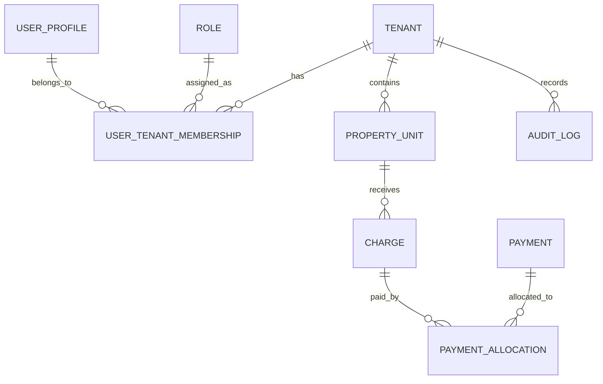

# RESIDENT Core — Domain Map v0.2

## 1. Información
Ruta: `docs/sdd/domain-map.md`  
Versión: 0.2  
Cambio: separación de identidad técnica y autorización de negocio.

## 2. Dominio principal
Gestión transaccional, financiera, operativa y comunitaria de conjuntos residenciales bajo un modelo multitenant.

## 3. Lenguaje ubicuo
| Término | Definición |
|---|---|
| RESIDENT Portal | Portal WordPress de FASE 1. |
| RESIDENT Core | Sistema transaccional central. |
| Identity Provider | Servicio externo para identidad técnica. |
| Keycloak | Identity Provider objetivo antes de microservicios. |
| Tenant | Conjunto residencial dentro de la plataforma. |
| UserProfile | Perfil local mínimo de usuario en Core. |
| keycloakSubjectId | Identificador `sub` emitido por Keycloak. |
| Membership | Relación usuario-tenant. |
| Rol funcional | Perfil de negocio dentro de tenant. |
| Permiso de negocio | Acción autorizada, por ejemplo `payments.confirm`. |
| Unidad habitacional | Casa, departamento, lote, bodega o parqueadero. |
| Cargo | Valor financiero contra una unidad. |
| Pago | Registro de dinero recibido. |

## 4. Subdominios
Core Domain: finanzas residenciales, alícuotas, pagos, conciliación, multas, reportes y autorización por recurso.  
Supporting Domains: residentes, propiedades, reservas, reuniones, comunicaciones, documentos, WordPress, n8n, Keycloak.  
Generic Domains: identidad técnica, sesiones, MFA, correo, storage, logs y configuración.

## 5. Bounded contexts
```text
Platform Management
Tenant Management
Identity Integration
Access and Authorization
Residents and Properties
Financial Management
Payments and Reconciliation
Reservations and Rentals
Fines and Sanctions
Meetings and Attendance
Communications and Notifications
Reporting and Analytics
Audit and Compliance
External Integrations
```

## 6. Identity Integration
Integra identidad técnica. MVP puede usar auth propia temporal; objetivo: Keycloak. Keycloak gestiona login, credenciales, sesiones, refresh tokens, MFA, password reset, tokens, federación y SSO.

## 7. Access and Authorization
Gestiona membership usuario-tenant, roles funcionales, permisos, acceso por recurso y auditoría.

```text
Keycloak autentica; RESIDENT Core autoriza.
```

## 8. Contextos de negocio
Tenant Management: Tenant, TenantProfile, TenantConfiguration, TenantBranding, TenantContactInfo, WordPressMapping.  
Residents and Properties: Person, LegalEntity, PropertyUnit, PropertyOwnership, Residency, Lease, Vehicle, Pet.  
Financial: ChargeConcept, FeeSchedule, Fee, ExtraordinaryFee, Charge, AccountStatement, Balance, LateFeeRule, Adjustment, Reversal.  
Payments: Payment, PaymentAllocation, PaymentReceipt, BankAccount, BankMovement, Reconciliation.

## 9. Integraciones
WordPress es portal. Keycloak es IdP objetivo. n8n automatiza procesos auxiliares. Correo/WhatsApp notifican. Banco/CSV importa movimientos. Storage guarda documentos.

## 10. Modelo conceptual


## 11. Invariantes
Todo registro operativo pertenece a tenant. Ningún usuario accede a otro tenant sin autorización. Movimientos financieros no se eliminan físicamente. WordPress y n8n no son fuente transaccional. Keycloak no sustituye autorización de negocio.

## 12. Eventos
TenantCreated, UserProfileLinkedToIdentityProvider, UserJoinedTenant, UserRoleChanged, MonthlyFeesGenerated, ChargeCreated, PaymentRegistered, PaymentConfirmed, PaymentReversed, ReconciliationMatchConfirmed, ReservationApproved, FineIssued, NotificationSent, AuditLogCreated.

## 13. MVPs
MVP 1: tenants, users-roles-access, residents-properties, dues-fees, payments, account-statements, audit, reports, WordPress integration.  
MVP 2: reservations, fines, notifications, bank-reconciliation, documents.  
MVP 3: meetings, attendance, voting, resolutions.  
MVP 4: n8n automations, AI-assisted reports, resident self-service.

## 14. Conclusión
El dominio separa identidad técnica de autorización de negocio. Keycloak autentica; Core decide qué puede hacer cada usuario dentro de cada tenant y recurso.
